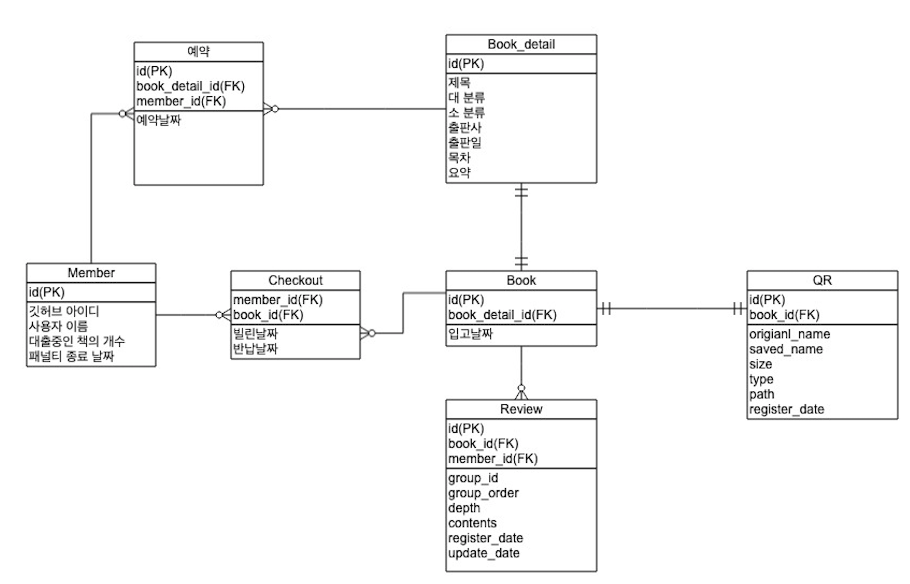

# woowa_library
우아한 테크 코스 내 도서 관리를 위한 프로그램

## 우아한 도서관

------

백엔드 :  JM, 에이든

프론트 : 이바, 슬로스

QR / 슬랙 : 베디

## ERD

# 기능 구현 목록

- 대출
  - 멤버가 대출을 신청한다
  - 대여 가능 권수 (available_book_limit) 를 1 감소한다.
    - 만약에 penalty_date가 현재 날짜보다 크면 대출 불가능
  - book_detail의 status 1감소, borrow_count 1증가
  - checkout에 member_id, book_id 추가 borrow_date는 현재 시간
- 반납
  - 멤버의 available_book_limit 1증가 
  - checkout의 borrow_date와 반납 날짜를 비교해서 2주 초과시 penalty_date에 현재날짜 + 초과 날짜 입력후 
    - 패널티 날짜는 code에 직접 입력하고 추후에 변경 고려.
  - checkout의 row 삭제
  - book_detail의 status 1 증가
- 책 검색
  - 전체 검색, 이름 검색, 카테고리 검색
  - 정렬 - 인기, 출판년도 순서
  - book과 book_detail, book_image 보여주기
  - 조건에 맞는 책들을 한번에 모든 책을 다 보여준다. 
    - 페이징 or 무한스크롤 or all
- 개인 대출 현황 조회
  - checkout, book, book_image 가져오기 
  - 도서별 남은 연체기간 표시
  - 대출일짜 초과한 책은 연체 표시
- 관리자 페이지
  - 이름으로 책 조회
  - 책 추가 
  - 책 정보 변경
  - 책 삭제
  - 연체 책 목록 보기
    - checkout에서 borrow_date로 검색하기
- 슬랙 기능
  - 연체 알람
  - 예약한 책 반납했을 때 

### 추후 업데이트 ?

- 회원가입 / 로그인
- 희망 도서 신청
- 조르기 / 예약
- 책 리뷰(아카이빙, 댓글)
- 게시판 (대나무숲)

- 논의 해야 할 문제
- 1인당 책 대출 권수
- 대출 기간
- 연체시 패널티
- 회원가입 / 로그인
- 우아한형제들 이미지 파일 문의

- 사용 기술
- Java
- Java Spark
- MySQL
- AWS
- Gradle
- HTML5, CSS3, Bootstrap, Handlebars, javascript, jquery

- 규칙
- 성과보다는 성장이 목적이다.
- 각이 안 나오면 바로 바로 얘기하자.
- 데일리, 마무리 미팅 (10분) 회의
- github 형상관리
- log 잘 남기기
- 마음 상하지 않게 지적하고, 지적 받았다고 마음 상하지 말자.
- 6월 13일 마감

------

1. Git repo 만들기
2. DB 짜기
3. 페이지 구상
